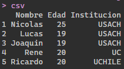
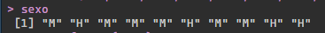
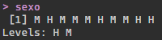
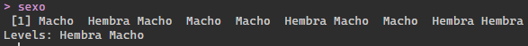
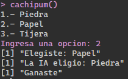
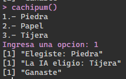
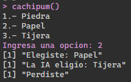

## Desafio 1:

#### Realizar 10 ejemplos de operaciones

```{r}
op1 = 320 * 102
op2 = op1 / 10
op3 = log10(op2) + op1 - ( op1/300 )
op4 = op3 + sqrt(op2) + sin(op1)
op5 = round((op1 - op2 * 3/op4 - op3/( op1 / 2 )), 2)
op6 = 200 - 100 * 42 / cos(10)
op7 = op6 - op5
op8 = op6 + 4 * op7
op9 = op7 - 2/op8
op10 = 100 / ( cos(3) * sin(8) )
```

## Desafio 2:

#### Ejemplos usando otros tipos de estructura de datos

```{r}
csv = read.csv("U:/Codigo/R/prueba.csv", header=TRUE, sep=";")

sec_num = 1:30

sexo = c("M", "H", "M", "M", "M", "H", "M", "M", "H", "H")
sexo = factor(sexo)
sexo = factor(sexo,levels=c("H","M"),labels=c("Hembra","Macho"))
```

Aca podemos ver imagenes de lo que se obtiene









## Desafio 3:

#### Crear una función que permita jugar piedra, papel o tijera

```{r}
cachipum = function () {
  cat("1.- Piedra\n2.- Papel\n3.- Tijera")
  user = as.integer(readline(prompt = "Ingresa una opcion: "))
  ia = sample(1:3,1)
  print(paste("Elegiste:", switch(user, "Piedra", "Papel", "Tijera")))
  print(paste("La IA eligio:", switch(ia, "Piedra", "Papel", "Tijera")))
  if ( user == ia ) {
    print("Empate")
  }
  if ( (user == 1 & ia == 2) | (user == 2 & ia == 3) | (user == 3 & ia == 1) ) {
    print("Perdiste")
  }
  if ( (user == 2 & ia == 1) | (user == 3 & ia == 2) | (user == 1 & ia == 3) ) {
    print("Ganaste")
  }
}
```

Aca podemos ver algunos ejemplos de uso:







## Desafio 4:

#### Utilizar un dataset y describir para que se usa y que es cada variable, ademas usar plot y summary y explicar el resultado

Se utiliza el dataset beaver 1 que muestra la dinamica de temperatura de un castor hembra en un periodo de un dia con lapsos de diez minutos, este dataset podria ser utilizado para analizar la fluctiación de temperatura de estos animales en su ambiente.

fuente: P. S. Reynolds (1994) Time-series analyses of beaver body temperatures. Chapter 11 of Lange, N., Ryan, L., Billard, L., Brillinger, D., Conquest, L. and Greenhouse, J. eds (1994) Case Studies in Biometry. New York: John Wiley and Sons.

```
example1 = datasets::beaver1
example1
summary(example1)
plot(example1)
```

Resultado de invocar a example1:

```{r, echo=FALSE}
example1 = datasets::beaver1
example1
```

De aca podemos ver 4 variables:

- Dia: es un entero que representa el dia que es monitoreado el castor, toma valores entre 0 a 365 y se mide en dias.

- Tiempo: es un entero que representa la hora de monitoreo, toma valores entre 0 a 2350 (00:00 - 23:50) y se mide en horas.

- Temperatura: un float que representa la temperatura del castor, no tiene un rango de valores fijo y se mide en celsius.

- Actividad: un entero que representa un booleano para indicar si el castor tuvo actividad fuera del refugio, toma valores entre 0 y 1, no tiene unidad de medida.

Resultado de usar summary:

```{r, echo=FALSE}
example1 = datasets::beaver1
summary(example1)
```

Se puede observar que muestra estadísticas de los datos.

Resultado de usar plot:

```{r, echo=FALSE}
example1 = datasets::beaver1
plot(example1)
```

Se puede ver un graficos comparando cada una de las variables.
